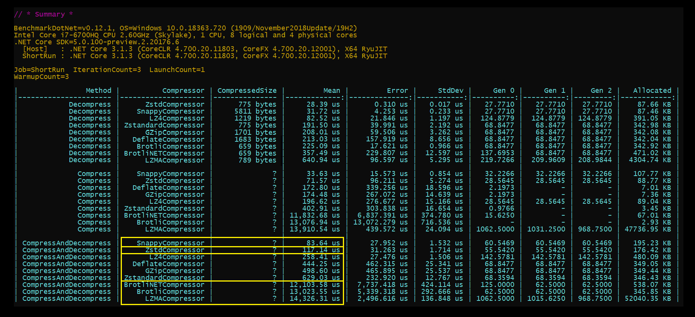

[](https://www.nuget.org/packages/EasyCompressor)
[](https://opensource.org/licenses/MIT)
[](https://github.com/mjebrahimi/EasyCompressor)

# EasyCompressor

 An **Easy-to-Use** and **Optimized** compression library for .NET that unified several compression algorithms including **LZ4**, **Snappy**, **Zstd**, **LZMA**, **Brotli**, **GZip**, **ZLib**, and **Deflate**. 

Along with a great [**Performance Benchmark**](#benchmarks) between different compression algorithms.

This library aids in **Improving Performance** by **Reducing Memory Usage** and **Bandwidth Usage**. (see [How](#improving-data-transfer-speed-by-sendingreceiving-less))

## Usage

- Compress your **BLOB** data for **Archiving** and Saving the **Storage** (on average from **30% to 90%**)
- Compress your **Caching** objects for **Saving** the **Memory Usage**  (it also has a nice integration with [EasyCaching](https://github.com/dotnetcore/EasyCaching))
- **Reduce** the **Bandwidth Usage** of your network by reducing the volume of data sent or received. (see [How](#improving-data-transfer-speed-by-sendingreceiving-less))
- **Improve** the **Performance** of your **I/O Operations** like **Service-to-Service Communication**. (see [How](#improving-data-transfer-speed-by-sendingreceiving-less))

## Features

- Offers a range of compression algorithms, including **LZ4**, **Snappy**, **Zstd**, **LZMA**, **Brotli**, **GZip**, **ZLib**, and **Deflate**.
- Support for **async/await** operations with support of **CancellationToken**.
- **Stream** operations are fully supported.
- **Optimized** and implemented with a focus on performance.

### Note

The **default** comparison levels are carefully configured based on extensive benchmarking to ensure the **highest level of efficiency** and **speed** at a **reasonable compression ratio**.

### Improving Data Transfer Speed by Sending/Receiving Less

Compression/Decompression has overhead but it reduces the size of your data, which can potentially result in faster transfer times, even when accounting for the additional time required for compression and decompression.

When a file is compressed, it becomes smaller in size, which means it requires less bandwidth to transfer. If the compression ratio is significant, the reduced file size can compensate for the extra time needed for compression and decompression.

For example, let's say you have an uncompressed file that takes 10 seconds to transfer. If you compress this file using a fast compressor like LZ4, Snappy, or Zstd, the compression time might be around 1 second. However, the compressed file size is significantly smaller, let's say it's only 20% of the original size. Now, when you transfer the compressed file, it will only take 2 seconds (20% of the original transfer time). In this scenario, the total time (compression time + transfer time) would be 3 seconds (1 second for compression + 2 seconds for transfer), which is less than the original 10 seconds it would have taken to transfer the uncompressed file.

It's important to note that the actual time savings will depend on various factors, such as the compression ratio achieved, the speed of the compression and decompression algorithms, the network bandwidth, and other system-specific considerations. However, with fast compressors like LZ4, Snappy, or Zstd and significant compression ratios, it is possible to achieve overall time savings when transferring compressed files compared to transferring uncompressed files.

## Nuget Packages


| Package      | Description
| ------------ | ----------------------
| [EasyCompressor](https://www.nuget.org/packages/EasyCompressor/) | Including Algorithms :<br/>- Brotli *(**Highest** compression ratio - the **Smallest** size) (**Only** available in .NETCoreApp2.1, .NETStandard2.1 and above)*<br/>- GZip<br/>- Deflate<br/>- ZLib *(**Only** available in .NET6.0 and above)*
| [EasyCompressor.LZ4](https://www.nuget.org/packages/EasyCompressor.LZ4/)⭐️ | Algorithm: LZ4<br/>Extremely Fast (**Recommended** - see [Benchmarks](#benchmarks))
| [EasyCompressor.Snappier](https://www.nuget.org/packages/EasyCompressor.Snappier/)⭐️ | Algorithm: Snappy<br/>Extremely Fast (**Recommended** - see [Benchmarks](#benchmarks))
| [EasyCompressor.ZstdSharp](https://www.nuget.org/packages/EasyCompressor.ZstdSharp/)⭐️ | Algorithm: Zstd (Zstandard)<br/>Extremely Fast (**Recommended** - see [Benchmarks](#benchmarks))
| [EasyCompressor.LZMA](https://www.nuget.org/packages/EasyCompressor.LZMA/) | Algorithm: LZMA<br/>High compression ratio (small size) but very Slow (**Not recommended** - see [Benchmarks](#benchmarks))
| [EasyCompressor.Zstd](https://www.nuget.org/packages/EasyCompressor.Zstd/) *(deprecated)* | Instead, use [EasyCompressor.ZstdSharp](https://www.nuget.org/packages/EasyCompressor.ZstdSharp/).
| [EasyCompressor.Snappy](https://www.nuget.org/packages/EasyCompressor.Snappy/) *(deprecated)* | Instead, use [EasyCompressor.Snappier](https://www.nuget.org/packages/EasyCompressor.Snappier/)
| [EasyCompressor.BrotliNET](https://www.nuget.org/packages/EasyCompressor.BrotliNET/) *(deprecated)* | Instead, use BrotliCompressor in [EasyCompressor](https://www.nuget.org/packages/EasyCompressor/) itself (base package)<br/>*(Use **only** if your project targets .NETFramework462 and above or .NETCoreApp2.0)*
| [EasyCaching.Extensions.EasyCompressor](https://www.nuget.org/packages/EasyCaching.Extensions.EasyCompressor/)⭐️ | A **winning combination** by integrating with [EasyCaching](https://github.com/dotnetcore/EasyCaching) to compress your **cache data**. (Recommended)<br/>See [How to use](https://github.com/mjebrahimi/EasyCompressor/tree/master/src/EasyCaching.Extensions.EasyCompressor/README.md)

**Note :**

All of these packages are **cross-platform** except `EasyCompressor.Zstd` and `EasyCompressor.Snappy` which are **not cross-platform** because their underlying library are just a wrapper around the native dlls only for windows.


## Get Started

### 1. Install Package

```bash
PM> Install-Package EasyCompressor.LZ4

PM> # Install-Package EasyCompressor (for Brotli, GZip, Deflate, ZLib)
PM> # Install-Package EasyCompressor.Snappier
PM> # Install-Package EasyCompressor.ZstdSharp
PM> # Install-Package EasyCompressor.LZMA
PM> # Install-Package EasyCompressor.Zstd (deprecated)
PM> # Install-Package EasyCompressor.Snappy (deprecated)
PM> # Install-Package EasyCompressor.BrotliNET (deprecated)
```

### 2. Using New Instance or the Shared Instance

```csharp
public class YourClass
{
    private readonly ICompressor _compressor;

    public YourClass()
    {
        //--------------------------------------- New Instance ---------------------------------------
        _compressor = new LZ4Compressor();            //package : EasyCompressor.LZ4

        //_compressor = new ZstdSharpCompressor();    //package : EasyCompressor.Snappier
        //_compressor = new BrotliCompressor();       //package : EasyCompressor
        //_compressor = new GZipCompressor();         //package : EasyCompressor
        //_compressor = new DeflateCompressor();      //package : EasyCompressor
        //_compressor = new ZLibCompressor();         //package : EasyCompressor
        //_compressor = new LZMACompressor();         //package : EasyCompressor.LZMA
        //_compressor = new ZstdCompressor();         //package : EasyCompressor.Zstd (deprecated)
        //_compressor = new SnappyCompressor();       //package : EasyCompressor.Snappy (deprecated)
        //_compressor = new BrotliNETCompressor();    //package : EasyCompressor.BrotliNET (deprecated)


        //--------------------------------------- Shared Instance ---------------------------------------
        _compressor = LZ4Compressor.Shared;            //package : EasyCompressor.LZ4

        //_compressor = ZstdSharpCompressor.Shared;    //package : EasyCompressor.Snappier
        //_compressor = BrotliCompressor.Shared;       //package : EasyCompressor
        //_compressor = GZipCompressor.Shared;         //package : EasyCompressor
        //_compressor = DeflateCompressor.Shared;      //package : EasyCompressor
        //_compressor = ZLibCompressor.Shared;         //package : EasyCompressor
        //_compressor = LZMACompressor.Shared;         //package : EasyCompressor.LZMA
        //_compressor = ZstdCompressor.Shared;         //package : EasyCompressor.Zstd (deprecated)
        //_compressor = SnappyCompressor.Shared;       //package : EasyCompressor.Snappy (deprecated)
        //_compressor = BrotliNETCompressor.Shared;    //package : EasyCompressor.BrotliNET (deprecated)
    }

    static static void ProcessData(byte[] bytes)
    {
        // Compress your original byte[] and return compressed byte[]
        var compressedBytes = _compressor.Compress(bytes);

        // Decompress compressed byte[] and return uncompressed byte[]
        var uncompressedBytes = _compressor.Decompress(compressedBytes);
    }

    public static void ProcessStream(Stream input, stream output)
    {
        // Read input stream and Compress into output stream
        _compressor.Compress(input, output);

        // Read input stream and Decompress into output stream
        _compressor.Decompress(input, output);
    }
}
```

### 3. Using Dependency Injection

#### Add Services

```csharp
public void ConfigureServices(IServiceCollection services)
{
    //...
    services.AddLZ4Compressor();            //package : EasyCompressor.LZ4

    //services.AddSnappierCompressor();     //package : EasyCompressor.Snappier
    //services.AddZstdSharpCompressor();    //package : EasyCompressor.ZstdSharp
    //services.AddBrotliCompressor();       //package : EasyCompressor
    //services.AddGZipCompressor();         //package : EasyCompressor
    //services.AddDeflateCompressor();      //package : EasyCompressor
    //services.AddZLibCompressor();         //package : EasyCompressor
    //services.AddLZMACompressor();         //package : EasyCompressor.LZMA
    //services.AddZstdCompressor();         //package : EasyCompressor.Zstd (deprecated)
    //services.AddSnappyCompressor();       //package : EasyCompressor.Snappy (deprecated)
    //services.AddBrotliNETCompressor();    //package : EasyCompressor.BrotliNET (deprecated)
}
```

#### Inject/Resolve it and use it

```csharp
using EasyCompressor;

public class YourClass
{
    private readonly ICompressor _compressor;

    public YourClass(ICompressor compressor) //Inject using dependency injection
    {
        _compressor = compressor;
        //Or resolve it using IServiceProvider
        //_compressor = serviceProvider.GetService<ICompressor>()
    }

    public void ProcessData(byte[] bytes)
    {
        // Compress your original byte[] and return compressed byte[]
        var compressedBytes = _compressor.Compress(bytes);

        // Decompress compressed byte[] and return uncompressed byte[]
        var uncompressedBytes = _compressor.Decompress(compressedBytes);
    }

    public void ProcessStream(Stream input, stream output)
    {
        // Read input stream and Compress into output stream
        _compressor.Compress(input, output);

        // Read input stream and Decompress into output stream
        _compressor.Decompress(input, output);
    }
}
```

### 4. Using Named Instances

#### Register Named compressors

```csharp
public void ConfigureServices(IServiceCollection services)
{
    //...
    services.AddLZ4Compressor("lz4");                 //package : EasyCompressor.LZ4
    services.AddSnappierCompressor("snappier");       //package : EasyCompressor.Snappier
    services.AddZstdSharpCompressor("zstdsharp");     //package : EasyCompressor.ZstdSharp

    //services.AddBrotliCompressor("brotli");         //package : EasyCompressor
    //services.AddGZipCompressor("gzip");             //package : EasyCompressor
    //services.AddDeflateCompressor("deflate");       //package : EasyCompressor
    //services.AddZLibCompressor("zlib");             //package : EasyCompressor
    //services.AddLZMACompressor("lzma");             //package : EasyCompressor.LZMA
    //services.AddZstdCompressor("zstd");             //package : EasyCompressor.Zstd (deprecated)
    //services.AddSnappyCompressor("snappy");         //package : EasyCompressor.Snappy (deprecated)
    //services.AddBrotliNETCompressor("brotlinet");   //package : EasyCompressor.BrotliNET (deprecated)
}
```

#### Resolve it using ICompressorProvider

```csharp
using EasyCompressor;

public class YourClass
{
    private readonly ICompressor _lz4Compressor;
    private readonly ICompressor _snappierCompressor;
    private readonly ICompressor _zstdsharpCompressor;

    public YourClass(ICompressorProvider compressorProvider)
    {
        _lz4Compressor = compressorProvider.GetCompressor("lz4");
        _snappierCompressor = compressorProvider.GetCompressor("snappier");
        _zstdsharpCompressor = compressor.GetCompressor("zstdsharp");
    }
}
```

## Benchmarks

👉 To view the **Full** benchmark, visit this [HTML Page](https://mjebrahimi.github.io/EasyCompressor/docs/Benchmark-Binary-Mean.html). 👈

<!-- ### Tips and Results

**Original data size is:**
- **89,535 bytes (about ≈ 90 KB)** (binary serialized output of a json file by messagepack).

**Compressed data size (for example):**
- **776 bytes for Zstd** (115x compression ratio) that results in **99.13% memory and bandwidth saving.**
- **1,234 bytes for LZ4** (72x compression ratio) that results in **98.62% memory and bandwidth saving.**

**Maximum Compression:**
- Brotli
- Zstd
- LZMA
- LZ4

**Fastest Speed:**
- Zstd
- Snappy
- LZ4

**Most Efficient:**
- Zstd (*windows only package*)
- LZ4 (*cross-platform package*)

**Moderated:**
- GZip
- Deflate -->



### Other Benchmarks

#### Compressing/Decompressing Binary Data (byte[])

- Comparison in terms of **Speed (Mean/Execution Time)** (visit it's [HTML](https://mjebrahimi.github.io/EasyCompressor/docs/Benchmark-Binary-Mean.html) or [Image](https://mjebrahimi.github.io/EasyCompressor/docs/Benchmark-Binary-Mean.png))
- Comparison in terms of **Memory Usage (Allocation Size)** (visit it's [HTML](https://mjebrahimi.github.io/EasyCompressor/docs/Benchmark-Binary-Allocated.html) or [Image](https://mjebrahimi.github.io/EasyCompressor/docs/Benchmark-Binary-Allocated.png))

#### Compressing/Decompressing Stream Data

- Comparison in terms of **Speed (Mean/Execution Time)** (visit it's [HTML](https://mjebrahimi.github.io/EasyCompressor/docs/Benchmark-Stream-Mean.html) or [Image](https://mjebrahimi.github.io/EasyCompressor/docs/Benchmark-Stream-Mean.png))
- Comparison in terms of **Memory Usage (Allocation Size)** (visit it's [HTML](https://mjebrahimi.github.io/EasyCompressor/docs/Benchmark-Stream-Allocated.html) or [Image](https://mjebrahimi.github.io/EasyCompressor/docs/Benchmark-Stream-Allocated.png))

#### Compressing/Decompressing Stream Data (Async)

- Comparison in terms of **Speed (Mean/Execution Time)** (visit it's [HTML](https://mjebrahimi.github.io/EasyCompressor/docs/Benchmark-StreamAsync-Mean.html) or [Image](https://mjebrahimi.github.io/EasyCompressor/docs/Benchmark-StreamAsync-Mean.png))
- Comparison in terms of **Memory Usage (Allocation Size)** (visit it's [HTML](https://mjebrahimi.github.io/EasyCompressor/docs/Benchmark-StreamAsync-Allocated.html) or [Image](https://mjebrahimi.github.io/EasyCompressor/docs/Benchmark-StreamAsync-Allocated.png))

### Key Results and Conclusion

#### Best Compressors based on Overall Performance (Speed and Memory Allocation) in each case

| Operation    | Binary    | Stream     | StreamAsync
| ------------ | --------- | ---------- | -----------
| **Compress**     | SnappierCompressor<br/>LZ4Compressor<br/>ZstdSharpCompressor | SnappierCompressor<br/>LZ4Compressor<br/>BrotliCompressor | LZ4Compressor<br/>BrotliCompressor<br/>---
| **Decompress**   | LZ4Compressor<br/>SnappierCompressor<br/>ZstdSharpCompressor | SnappierCompressor<br/>LZ4Compressor<br/>ZstdSharpCompressor | ZstdSharpCompressor<br/>LZ4Compressor<br/>---

#### Best Compressors based on Highest compression (Smallest size)

1. BrotliCompressor (smaller in medium/small data with **moderate** speed and memory usage)
2. LZMACompressor (smaller in large data but **very slow** and memory inefficient)
3. ZstdSharpCompressor (**fastest** meanwhile with acceptable/good enough level of compression)


#### BenchmarkDotNetVisualizer🌈

All the benchmarks are visualized using [BenchmarkDotNetVisualizer](https://github.com/mjebrahimi/BenchmarkDotNetVisualizer).

## Contributing

Create an [issue](https://github.com/mjebrahimi/EasyCompressor/issues/new) if you found a **BUG** or have a **Suggestion** or **Question**.

**Or if you want to develop this project:**

1. Fork it
2. Create your feature branch: `git checkout -b my-new-feature`
3. Commit your changes: `git commit -am 'Add some feature'`
4. Push to the branch: `git push origin my-new-feature`
5. Submit a pull request

## Todo

Open an [issue](https://github.com/mjebrahimi/EasyCompressor/issues/new) or [discussion](https://github.com/mjebrahimi/EasyCompressor/discussions/new/choose) and tell me which integration or feature you like the most.

- [ ] Write integrations with **Binary Serializer** libraries such as [MessagePack](https://www.nuget.org/packages/MessagePack), [MsgPack.Cli](https://www.nuget.org/packages/MsgPack.Cli), [MemoryPack](https://www.nuget.org/packages/MemoryPack), [Google.Protobuf](https://www.nuget.org/packages/Google.Protobuf), [protobuf-net](https://www.nuget.org/packages/protobuf-net). (and maybe [Bond.CSharp](https://www.nuget.org/packages/Bond.CSharp) and [Hyperion](https://www.nuget.org/packages/Hyperion))
- [ ] Write integrations with **Redis client** libraries such as [StackExchange.Redis](https://www.nuget.org/packages/StackExchange.Redis), [ServiceStack.Redis](https://www.nuget.org/packages/ServiceStack.Redis), [CSRedisCore](https://www.nuget.org/packages/CSRedisCore), [FreeRedis](https://www.nuget.org/packages/FreeRedis).
- [ ] Write integrations with **Caching** libraries such as [Microsoft.Extensions.Caching.*](https://www.nuget.org/packages/Microsoft.Extensions.Caching.StackExchangeRedis/), [LazyCache](https://www.nuget.org/packages/LazyCache), and [EnyimMemcachedCore](https://www.nuget.org/packages/EnyimMemcachedCore). (and maybe [CachingFramework.Redis](https://www.nuget.org/packages/CachingFramework.Redis), [CacheManager.Core](https://www.nuget.org/packages/CacheManager.Core))
- [ ] Write integrations with **Message Broker** libraries such as [RabbitMQ.Client](https://www.nuget.org/packages/RabbitMQ.Client), [Azure.Messaging.ServiceBus](https://www.nuget.org/packages/Azure.Messaging.ServiceBus), [Confluent.Kafka](https://www.nuget.org/packages/Confluent.Kafka), [EasyNetQ](https://www.nuget.org/packages/EasyNetQ), [NetMQ](https://www.nuget.org/packages/NetMQ), [NATS.Client](https://www.nuget.org/packages/NATS.Client), [Apache.NMS](https://www.nuget.org/packages/Apache.NMS). (and maybe [RawRabbit](https://www.nuget.org/packages/RawRabbit), [kafka-sharp](https://www.nuget.org/packages/kafka-sharp), [Microsoft.Azure.ServiceBus](https://www.nuget.org/packages/Microsoft.Azure.ServiceBus)).
- [ ] Write integrations with **Service Bus** libraries such as [MassTransit](https://www.nuget.org/packages/MassTransit), [NServiceBus](https://www.nuget.org/packages/NServiceBus), [Rebus](https://www.nuget.org/packages/Rebus), and [DotNetCore.CAP](https://www.nuget.org/packages/DotNetCore.CAP).
- [ ] Write integrations with other libraries such as [Polly.Caching.Distributed](https://www.nuget.org/packages/Polly.Caching.Distributed)

## Give a Star! ⭐️

If you find this repository useful and like it, why not give it a star? if not, never mind! :)

## License

Copyright © 2020 [Mohammd Javad Ebrahimi](https://github.com/mjebrahimi) under the [MIT License](https://github.com/mjebrahimi/EasyCompressor/LICENSE).
